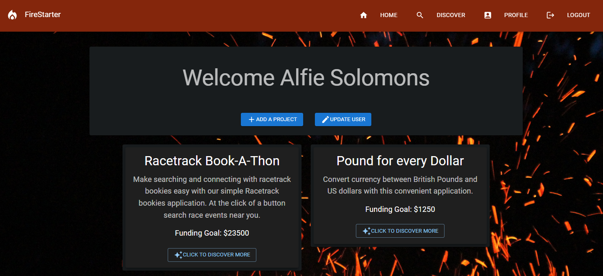

# Firestarter

### By Mackenzie Gray and Jason Steer

[](https://opensource.org/licenses/MIT)

## Description

A DAO (decentralised autonomous organisation) inspired full stack MERN application to connect developers with developers, and assist in lighting the spark of innovation for projects. 

Developers can signup and post new projects they are working on as well as browse other projects from other developers. Projects of interest then have the ability to be funded by developers or people who are not signed up but browsing the site. 

## Technologies used

- React
- GraphQL with a Node.js and Express.js server
- MongoDB/Mongoose ODM for the database
- Apollo client 
- MUI
- bcrypt 
- JWT authentication
- Nodemon
- Concurrently
- Heroku

## User Story 
```
AS A developer passionate about technology and projects  
I WANT to create a collaborative space for the developer community  
SO THAT I can connect with projects and developers and gain access to funding  
```
## Link to deployed application

[Click here to view Heroku application](https://secret-headland-78641.herokuapp.com/)

## Table of Contents

* [Installation](#Installation)
* [Usage](#Usage)
* [License](#License)
* [Screenshots](#Screenshots)
* [Contributing](#Contributing)
* [Tests](#Tests)
* [Acknowledgments](#Acknowledgments)
* [Questions](#Questions)

## Installation 

The application is installed with the following command: 

`npm install` 

The application is seeded with the following command:

`npm run seed`

The application is run concurrently with the following command: 

`npm run develop`

## Usage

Fork the repository, install the dependencies and start the fire of imagination and collaboration. 

## License

MIT

#### For more information on the license, click the badge icon in the title section.

## Screenshots





## Contributing

Fork the repo and/or get in contact with the authors to suggest changes or contributions. 

## Tests

The application can be tested by running the following command:

`npm test`

## Acknowledgments

- University of Sydney Coding Bootcamp
- [Julie Bryrd](https://www.artstation.com/artwork/O9dek)
- [MUI](https://mui.com/)
- [Stack Overflow](https://stackoverflow.com/)


## Questions

### For further information contact using the following:

#### GitHub: 

* [mdkgray](https://github.com/mdkgray)
* [eljsteer](https://github.com/eljsteer)

#### Email: 
* mdkulen@gmail.com 
* el.jsteer@gmail.com
